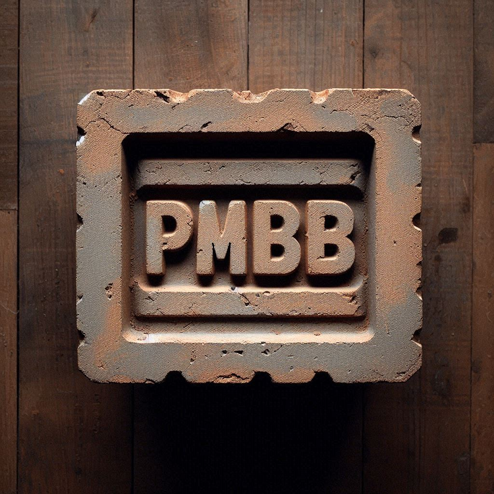

# PMBB Brickyard
Notebooks for exploring the use of databricks on Penn Medicine BioBank (PMBB) data

## To clone into databricks
1. In a workspace, go to the "Create" button in upper right corner, and choose "Git folder"
2. For "Git repository URL" enter: https://github.com/PennMedicineVision/pmbb_brickyard.git
3. For "Git provider" choose GitHub from the dropdown menu
4. Leave "Git folder name" blank to use the repo name as the folder name

## To add/commit from databricks
1. Link your github account to your databricks account. [Instructions](https://docs.databricks.com/en/repos/get-access-tokens-from-git-provider.html)
2. Alternatively, just try to commit with an unlinked account and databricks will provide the necessary link/instructions on the fly
3. To commit additions/changes, click on the three dots in the right of the repo folder, and choose "Git"
   * Can also right click on repo name in the menu on left
5. Review changes, add a commit message, and press "Commit & Push"

# Links for more info on databricks
1. https://learn.microsoft.com/en-us/azure/databricks/
2. https://customer-academy.databricks.com/learn/external-ecommerce;view=none;redirectURL=?ctldoc-catalog-0=p-0~l-_en
3. https://learning.oreilly.com/videos/data-analysis-with/9781617297205VE/
4. https://pennmedicine-my.sharepoint.com/:f:/g/personal/xapakdyk_pennmedicine_upenn_edu/ElLz3qHiPdhBl9RLfbCmWnkBqFxrJ8HnPQi0lYvnWoNJeA?e=RjYtgF
5. https://learn.microsoft.com/en-us/azure/databricks/release-notes/runtime/15.2ml
6. https://www.databricks.com/solutions/accelerators/pixels-medical-image-processing

# PHI removal links
1. https://www.databricks.com/blog/2022/06/22/automating-phi-removal-from-healthcare-data-with-natural-language-processing.html
2. https://pubmed.ncbi.nlm.nih.gov/36416419/
3. https://github.com/BCHSI/philter-ucsf
4. https://nlp.johnsnowlabs.com/2022/03/03/clinical_deidentification_en_3_0.html
